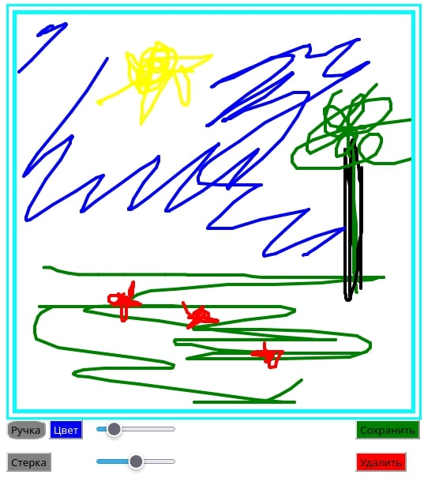

Этот проект после завершения планирую сделать частью моего <a href= "https://github.com/TimmMuranov/ESP-DISK">мини-сервера на ESP8266</a>. 
На данный момент я представляю два окна: одно сохраняет на сервер тексты (уже реализован), 
другой сохраняет картинки
(собственно, веб интерфейс рисовалки буду разрабатывать здесь).

  
**1.0** - Реализовано черчение кривыми линиями и сохранение в формате png.
